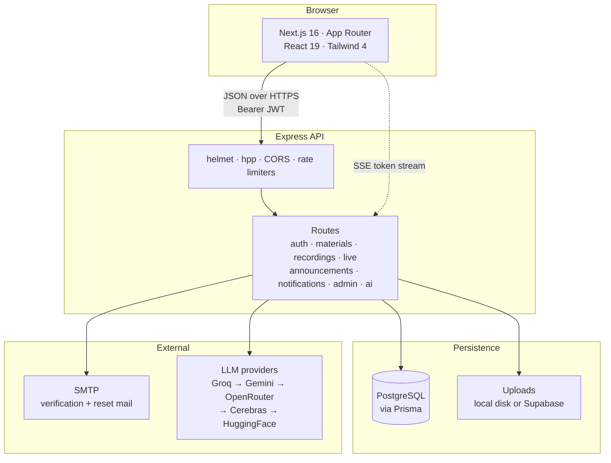

<div align="center">

# FIT23Hub

**One place for everything a batch of 400 students needs to get through a semester.**

Course material, recorded lectures, live Kuppi sessions, deadline announcements, and an AI study
assistant that answers from *your* notes — built for the Faculty of Information Technology,
University of Moratuwa, Batch 23.

[](https://nextjs.org)
[](https://react.dev)
[](https://typescriptlang.org)
[](https://tailwindcss.com)
[](https://expressjs.com)
[](https://prisma.io)
[](https://postgresql.org)

</div>

---

## Why this exists

Every batch solves the same problem badly. Lecture notes scatter across a dozen WhatsApp groups,
the one person with the good summary graduates, nobody can find last year's past paper, and the
message announcing that the deadline moved is buried under four hundred unread messages.

FIT23Hub replaces that with a single, permanent, searchable home — and then does a few things the
group chat never could.

<table>
<tr>
<td width="33%" valign="top">

### Answers from your own notes

Upload a PDF and ask it questions. The assistant retrieves the passages that actually matter and
cites them, so you can check its work. It also turns a source into a quiz or a flashcard deck.

</td>
<td width="33%" valign="top">

### Deadlines you cannot miss

Announcements carry the date the thing is *due*, not just the date it was posted. Students see a
live countdown; admins see exactly who has and has not acknowledged a critical notice.

</td>
<td width="33%" valign="top">

### Nothing is ever really deleted

Removing a student or a material archives it. One click restores it, untouched. Only the platform
owner can destroy anything permanently, and only from the archive.

</td>
</tr>
</table>

---

## Contents

| | |
|---|---|
| [Feature tour](#feature-tour) | What students and admins can actually do |
| [Architecture](#architecture) | How the pieces fit together |
| [Getting started](#getting-started) | From clone to running in about five minutes |
| [Configuration](#configuration) | Every environment variable, explained |
| [The AI assistant](#the-ai-assistant) | Provider fallback, retrieval, and graceful degradation |
| [API reference](#api-reference) | Every endpoint |
| [Security](#security) | What is enforced, and where |
| [Deployment](#deployment) | Render, Docker, and horizontal scaling |
| [Project structure](#project-structure) | Where things live |

---

## Feature tour

### For students

| Area | What you get |
|---|---|
| **Materials library** | Notes, slides, lab sheets, tutorials and past papers, filtered by module, semester and level. Case-insensitive search across title, description, module and uploader. |
| **Recordings** | An archive of recorded Kuppi sessions, grouped by semester, playable inline or by link. |
| **Kuppi Live** | Scheduled and in-progress live sessions with a countdown to the next one and a one-click join. |
| **AI Learning** | Upload PDFs into projects, chat over them with streamed answers and citations, and generate quizzes and flashcards that open in a focused full-screen runner. |
| **Announcements** | A noticeboard of exam dates, deadlines, schedule changes and events — pinned items first, each with a live countdown and a "Got it" acknowledgement. |
| **Notifications** | A bell with unread counts for uploads, live sessions, announcements and account activity. |
| **Profile** | Avatar upload, password change, a full data export, and self-service account deletion. |

### For admins

| Area | What you get |
|---|---|
| **Console overview** | Live counts of students, admins, materials, recordings and active streams, auto-refreshing and refetching the moment you return to the tab. |
| **User management** | Suspend with a reason the student sees at sign-in, reactivate, and archive/restore accounts. |
| **Content moderation** | Archive and restore materials; permanent deletion is reserved for the platform owner. |
| **Publishing** | Upload recordings, schedule live sessions, flip them live, and attach recordings afterwards. |
| **Announcements** | Draft, publish, unpublish, edit, archive — plus a per-notice coverage report listing the students who have *not* acknowledged it. |

### The permission model

Three roles, with one deliberately immovable.

```
STUDENT   →  read everything, upload materials, use the assistant
ADMIN     →  everything above, plus moderation and publishing
SUPER_ADMIN  →  everything above, plus granting/revoking admin and permanent deletion
```

The super admin is re-asserted from the environment on every boot, so the account cannot be
demoted, suspended or removed from inside the app — not by another admin, and not by a bug. Only
the super admin can change anyone's role.

---

## Architecture



**The request path in one line:** the browser holds a JWT, every call goes through `lib/api.ts`
(which owns timeouts and error shaping), `requireAuth` re-validates the user against the database
behind a 15-second cache, and the route does its work.

A few deliberate choices worth knowing about:

- **Response compression skips `text/event-stream`.** gzip buffers output, which would hold AI
  tokens back until the whole answer finished — defeating the point of streaming.
- **Auth is re-checked per request, not trusted from the token.** A suspended, archived or
  unverified user is rejected within 15 seconds even with a valid, unexpired JWT.
- **Every list query filters `deletedAt`.** Archived rows are invisible to normal reads rather than
  filtered in the UI.

---

## Getting started

### Prerequisites

| | |
|---|---|
| Node.js | 20 or newer |
| PostgreSQL | 14+ — Docker is easiest |
| npm | ships with Node |

### 1. Clone and install

```bash
git clone https://github.com/dinithrathnayaka23/fit23hub.io.git
cd fit23hub.io

cd backend  && npm install && cd ..
cd frontend && npm install && cd ..
```

### 2. Start a database

```bash
docker run --name fit23hub-pg \
  -e POSTGRES_PASSWORD=postgres \
  -e POSTGRES_DB=fit23hub \
  -p 5432:5432 -d postgres:16
```

### 3. Configure the backend

```bash
cd backend
cp .env.example .env
```

The only values you *must* set to boot are `DATABASE_URL`, `DIRECT_URL` and `JWT_SECRET`. Set
`SUPER_ADMIN_EMAIL` to your own address to claim the owner account — leave the password blank and
it generates a random one you can claim via "Forgot password".

Everything else has a working default, and **the app runs with no AI keys at all** (see
[graceful degradation](#graceful-degradation)).

### 4. Create the schema

```bash
npm run prisma:push
```

### 5. Run both halves

```bash
# terminal 1
cd backend && npm run dev     # http://localhost:4000

# terminal 2
cd frontend && npm run dev    # http://localhost:3000
```

The frontend needs one variable, in `frontend/.env.local`:

```env
NEXT_PUBLIC_API_URL=http://localhost:4000/api
```

> **Mail in development:** leave `SMTP_*` blank and outgoing mail falls back to an Ethereal test
> inbox. Nothing is really delivered — a preview URL is printed in the backend log and returned to
> the UI, so you can click through verification and password-reset flows without a mail server.

---

## Configuration

<details>
<summary><b>Core — database, auth, origins</b></summary>

| Variable | Default | Notes |
|---|---|---|
| `DATABASE_URL` | — | Pooled connection string in production |
| `DIRECT_URL` | — | Direct connection, used for migrations only |
| `JWT_SECRET` | — | At least 32 characters in production |
| `JWT_EXPIRES_IN` | `7d` | Token lifetime |
| `PORT` | `4000` | |
| `CORS_ORIGIN` | `http://localhost:3000` | Comma-separated; empty allows any origin |
| `APP_URL` | `http://localhost:3000` | Used to build links in outgoing email |
| `TRUST_PROXY` | `0` | Set to `1` behind a load balancer so rate limits see real client IPs |

</details>

<details>
<summary><b>Platform owner and break-glass admin</b></summary>

| Variable | Default | Notes |
|---|---|---|
| `SUPER_ADMIN_EMAIL` | — | Claims the immovable owner account; re-asserted every boot |
| `SUPER_ADMIN_NAME` | `Platform Owner` | |
| `SUPER_ADMIN_INDEX` | `SUPER-ADMIN` | |
| `SUPER_ADMIN_PASSWORD` | — | Blank generates a random one |
| `ADMIN_EMAIL` | `admin@uom.lk` | Optional recovery admin, created on boot |
| `ADMIN_PASSWORD` | — | 10–72 chars with upper, lower, digit and symbol |

</details>

<details>
<summary><b>Storage and mail</b></summary>

| Variable | Default | Notes |
|---|---|---|
| `STORAGE_DRIVER` | `local` | `local` writes to `backend/uploads`, `supabase` uses object storage |
| `SUPABASE_URL` / `SUPABASE_SERVICE_ROLE_KEY` | — | Required when the driver is `supabase` |
| `SUPABASE_STORAGE_BUCKET` | `fit23hub-assets` | |
| `MAIL_FROM` | `FIT23Hub <no-reply@fit23hub.local>` | |
| `SMTP_HOST` / `SMTP_PORT` / `SMTP_USER` / `SMTP_PASS` | — | Blank falls back to Ethereal in development |
| `SMTP_SECURE` | `false` | |
| `PASSWORD_RESET_TTL_MINUTES` | `60` | |
| `EMAIL_VERIFY_TTL_MINUTES` | `1440` | |

</details>

<details>
<summary><b>AI providers and tuning</b></summary>

Model ids drift often. If a call 404s with *"model does not exist"*, list the live ids with
`curl <base>/models -H "Authorization: Bearer <key>"` and update the variable — **no code change
needed**, every model id is an environment variable.

| Variable | Default | Notes |
|---|---|---|
| `GROQ_API_KEY` | — | First in the chain |
| `GROQ_MODEL_CHAT` / `GROQ_MODEL_ARTIFACT` | `openai/gpt-oss-20b` / `openai/gpt-oss-120b` | |
| `GEMINI_API_KEY` | — | Second; also powers embeddings |
| `GEMINI_MODEL_CHAT` / `GEMINI_MODEL_ARTIFACT` | `gemini-flash-lite-latest` | |
| `OPENROUTER_API_KEY` | — | Third |
| `OPENROUTER_MODEL_CHAT` / `OPENROUTER_MODEL_ARTIFACT` | `google/gemma-4-31b-it:free` | |
| `CEREBRAS_API_KEY` / `HF_API_KEY` | — | Adapters exist; stay off unless keyed |
| `AI_REQUEST_TIMEOUT_MS` | `12000` | Enforced independently of the transport |
| `AI_PROVIDER_COOLDOWN_MS` | `60000` | How long a failing provider is skipped |
| `AI_CACHE_TTL_MS` / `AI_CACHE_MAX_ENTRIES` | `1800000` / `500` | Only *validated* responses are cached |
| `AI_USER_DAILY_CHAT_LIMIT` | `40` | Per student, per day |
| `AI_USER_DAILY_ARTIFACT_LIMIT` | `15` | Quizzes and flashcard decks |
| `GEMINI_EMBED_MODEL` | `gemini-embedding-001` | |
| `AI_VECTOR_WEIGHT` | `0.6` | Share of the hybrid score from vector similarity |

</details>

<details>
<summary><b>Rate limits</b></summary>

| Variable | Default | Window |
|---|---|---|
| `AUTH_RATE_LIMIT_MAX` | `50` | 15 minutes |
| `API_RATE_LIMIT_MAX` | `300` | 15 minutes |
| `AI_RATE_LIMIT_MAX` | `60` | 15 minutes, on top of the per-student daily quota |

</details>

---

## The AI assistant

This is the part with the most engineering behind it, so it is worth a section of its own.

### Retrieval

Uploaded PDFs are parsed, chunked, and embedded with Gemini. A question is scored against every
chunk using a **hybrid of cosine similarity and keyword overlap**, blended `0.6 / 0.4` by default:

> Vectors catch paraphrases — a question about *"normalization"* finds a chunk that only ever says
> *"3NF"* and *"BCNF"*. Keywords catch the exact module codes and acronyms that embeddings blur.
> Chunks with no embedding yet score on keywords alone, so retrieval never hard-fails.

The passages that win are quoted back as citations, so an answer is always checkable against the
source rather than taken on trust.

### Provider fallback

Five providers are tried in order, and a provider is only enabled when its key is present:

```
Groq  →  Gemini  →  OpenRouter  →  Cerebras  →  HuggingFace
```

The orchestration around that chain is where the real work is:

- **A deadline is enforced by the orchestrator**, not by hoping each provider's SDK honours an
  abort signal. A hung connection cannot stall the chain.
- **A failing provider goes into cooldown** and is skipped entirely for the next minute, instead of
  being retried on every request.
- **Responses are validated before they count as success.** A provider that returns a well-formed
  HTTP 200 containing malformed quiz JSON is treated as a *failure* and the chain moves on — and
  that bad content is never cached.
- **Streaming answers race first-token arrival against the deadline**, so a provider that accepts
  the connection and then goes quiet fails over instead of leaving a dead cursor blinking.

### Graceful degradation

The assistant is built to keep working as capability is removed:

| Configuration | Behaviour |
|---|---|
| All providers keyed | Full answers, streamed, with citations |
| Some keys missing | Chain adapts silently to whichever providers are configured |
| Every provider fails or is rate-limited | Falls back to showing the matching source passages |
| No AI keys at all | Same as above — retrieval-only, still genuinely useful |
| No Gemini key | Retrieval degrades to keyword-only; everything still works |

---

## API reference

All routes are prefixed with `/api`. Everything except registration, login and the public token
flows requires `Authorization: Bearer <jwt>`.

<details>
<summary><b>Authentication</b> — <code>/api/auth</code></summary>

| Method | Path | Purpose |
|---|---|---|
| `POST` | `/register` | Create a student account and send verification mail |
| `POST` | `/login` | Sign in; returns the token and a safe user object |
| `GET` | `/me` | The current user |
| `POST` | `/change-password` | |
| `POST` | `/forgot-password` | Always answers identically, to avoid leaking who has an account |
| `GET` | `/reset-password/:token` | Validate a reset link before showing the form |
| `POST` | `/reset-password` | |
| `GET` | `/verify-email/:token` | Validate a verification link |
| `POST` | `/verify-email` | |
| `POST` | `/resend-verification` | |
| `POST` | `/profile-image` | Avatar upload |
| `GET` | `/export-data` | Full personal data export |
| `DELETE` | `/account` | Self-service deletion; shared uploads are reassigned to an anonymous tombstone |

</details>

<details>
<summary><b>Materials</b> — <code>/api/materials</code></summary>

| Method | Path | Purpose |
|---|---|---|
| `GET` | `/` | Filter by query, category, module, semester, level; paginated and sortable |
| `POST` | `/` | Upload a file or link a URL |
| `PUT` | `/:id` | Owner or admin |
| `DELETE` | `/:id` | Archive — owner or admin |
| `GET` | `/categories` | |
| `POST` | `/:id/download` | Resolve the download URL |
| `GET` | `/admin/archived` | The archive (admin) |
| `DELETE` | `/admin/:id` | Archive (admin) |
| `POST` | `/admin/:id/restore` | Restore (admin) |
| `DELETE` | `/admin/:id/purge` | Permanent deletion — **super admin only**, archived rows only |

</details>

<details>
<summary><b>Announcements</b> — <code>/api/announcements</code></summary>

| Method | Path | Purpose |
|---|---|---|
| `GET` | `/` | Published, unexpired notices with your acknowledgement state folded in |
| `GET` | `/upcoming` | The next few dated notices, for the dashboard rail |
| `POST` | `/:id/acknowledge` | Idempotent — a double tap cannot fail |
| `GET` | `/admin/all` | Everything including drafts and the archive |
| `POST` | `/admin` | Create as draft or publish immediately |
| `PUT` | `/admin/:id` | Edit |
| `POST` | `/admin/:id/publish` | Publish and notify the batch |
| `POST` | `/admin/:id/unpublish` | Back to draft, keeping acknowledgements |
| `POST` | `/admin/:id/restore` | Restore from the archive |
| `DELETE` | `/admin/:id` | Archive |
| `GET` | `/admin/:id/acknowledgements` | Who has seen it — and who has not |

</details>

<details>
<summary><b>Recordings and live</b> — <code>/api/recordings</code>, <code>/api/live</code></summary>

| Method | Path | Purpose |
|---|---|---|
| `GET` | `/recordings` | Filter by module, semester, level |
| `POST` | `/recordings` | Upload MP4 or link a URL (admin) |
| `PUT` `DELETE` | `/recordings/:id` | Edit or remove (admin) |
| `GET` | `/live` | Scheduled and active sessions |
| `POST` | `/live` | Schedule (admin) |
| `PUT` | `/live/:id` | Edit, including the recording URL (admin) |
| `PATCH` | `/live/:id/status` | Flip live on or off (admin) |
| `DELETE` | `/live/:id` | Admin |

</details>

<details>
<summary><b>AI</b> — <code>/api/ai</code></summary>

| Method | Path | Purpose |
|---|---|---|
| `GET` `POST` | `/projects` | Group sources into workspaces |
| `GET` `POST` | `/sources` | List and upload PDFs |
| `GET` `POST` | `/chats` | Conversations, optionally scoped to a project |
| `GET` | `/chats/:chatId/messages` | History |
| `POST` | `/chats/:chatId/query` | Ask, buffered |
| `POST` | `/chats/:chatId/query/stream` | Ask, streamed over SSE |
| `POST` | `/chats/:chatId/quiz` | Generate a quiz from a source |
| `POST` | `/chats/:chatId/flashcards` | Generate a flashcard deck |
| `POST` | `/query` | One-shot question outside a chat |

</details>

<details>
<summary><b>Admin and notifications</b> — <code>/api/admin</code>, <code>/api/notifications</code></summary>

| Method | Path | Purpose |
|---|---|---|
| `GET` | `/admin/overview` | Console counts |
| `GET` | `/admin/users` | Search by name, index number or email |
| `PATCH` | `/admin/users/:id` | Role and suspension changes |
| `GET` | `/admin/users/archived` | Removed accounts |
| `DELETE` | `/admin/users/:id` | Archive an account |
| `POST` | `/admin/users/:id/restore` | Restore an account |
| `GET` | `/notifications` | Paginated, filterable by unread |
| `GET` | `/notifications/unread-count` | Drives the bell badge |
| `PATCH` | `/notifications/:id/read` | |
| `POST` | `/notifications/read-all` | |
| `DELETE` | `/notifications/:id` · `/notifications` | Dismiss one, or clear all |

</details>

---

## Security

| Layer | What is enforced |
|---|---|
| **Transport** | `helmet` security headers, `hpp` parameter-pollution guard, explicit CORS allowlist |
| **Rate limiting** | Separate budgets for auth, general API and AI, plus a per-student daily AI quota |
| **Passwords** | `bcrypt` hashes; 10–72 characters with upper, lower, digit and symbol |
| **Tokens** | Short-lived JWTs; the user row is re-validated per request behind a 15s cache |
| **Account state** | Suspended, unverified and archived accounts are refused at login *and* in middleware |
| **Registration** | `@uom.lk` addresses and the `23XXXXA` index format only |
| **Email flows** | Single-use hashed tokens with expiry; reset invalidates every prior outstanding link |
| **Privilege** | The super admin is immutable; only they can change roles or delete permanently |
| **Validation** | `zod` schemas at every write boundary |
| **Uploads** | Type and size checks before anything reaches disk or object storage |

**Suspension is checked before the password.** A suspended student always sees *why* they cannot
sign in, rather than a misleading "invalid credentials".

---

## Resilience and UX details

Small things that decide whether a platform feels trustworthy at 8pm the night before a deadline:

- **No page ever renders blank on failure.** Loading, failed and genuinely-empty are three distinct
  states, each with its own card — and a failed one offers a retry, or a sign-in link when the
  session has expired.
- **Requests time out.** 20 seconds for normal calls, 180 for uploads, rather than hanging forever.
- **Failures are described in plain language.** No API base URLs or environment variable names ever
  reach a student's screen.
- **Stale beats blank.** When a background refresh fails, the data already on screen stays and is
  flagged as possibly out of date.
- **Going offline is announced** the moment connectivity drops.

---

## Deployment

### Render (one-click via `render.yaml`)

The backend is described declaratively: it generates the Prisma client at build, pushes the schema
at start, and exposes `/api/health` for health checks. `TRUST_PROXY=1` and `STORAGE_DRIVER=supabase`
are set for you — supply the secrets in the dashboard.

### Docker and horizontal scaling

The `deploy/` directory carries what you need to run more than one backend instance:

| File | Purpose |
|---|---|
| `backend.Dockerfile` | Container image for the API |
| `docker-compose.scale.yml` | Multiple API replicas behind a load balancer |
| `nginx-backend-lb.conf` | The nginx configuration in front of them |

Switch `STORAGE_DRIVER` to `supabase` before scaling out — local disk uploads do not survive more
than one instance.

### Load testing

Both harnesses are pre-written for the real target of 400 concurrent students:

```bash
cd backend
npm run loadtest:k6          # k6
npm run loadtest:artillery   # Artillery
```

---

## Project structure

```
fit23hub.io/
├─ backend/
│  ├─ prisma/schema.prisma      # 15 models, 5 enums
│  ├─ loadtest/                 # k6 + Artillery, sized for 400 students
│  └─ src/
│     ├─ config/security.js     # CORS, the three rate limiters
│     ├─ middleware/auth.js     # requireAuth, requireRole, role helpers
│     ├─ routes/                # one module per resource
│     ├─ utils/
│     │  ├─ ai/                 # providers, llm chain, embeddings, retrieval,
│     │  │                      # cache, budget — plus two self-test harnesses
│     │  ├─ notifications.js    # fan-out helpers
│     │  ├─ search.js           # the one case-insensitive match helper
│     │  └─ storage.js          # local disk or Supabase
│     ├─ seed.js                # self-healing super admin
│     └─ server.js
│
├─ frontend/
│  ├─ app/
│  │  ├─ (auth)/                # login, register, verify, reset
│  │  ├─ dashboard/             # the student side
│  │  └─ admin/                 # the console
│  ├─ components/
│  │  ├─ ai/                    # quiz and flashcard runners
│  │  ├─ cards/ · sections/ · ui/
│  │  └─ ui/StateCard.tsx       # the shared error / empty / loading states
│  └─ lib/
│     ├─ api.ts                 # the single API client: timeouts, error shaping
│     ├─ auth.ts · types.ts
│     └─ use-online.ts
│
├─ deploy/                      # Dockerfile, compose, nginx
└─ render.yaml
```

---

## Roadmap

Honest about what is not done yet:

- [ ] Search input on the admin users page — the API supports it, the console does not expose it
- [ ] Trigram indexes (`pg_trgm`) if the library ever grows past tens of thousands of rows
- [ ] Automated test suite; today the AI layer has self-test harnesses and the rest is verified by hand
- [ ] Gallery page is hardcoded and currently unreachable — it has no navigation link and needs
      admin-managed albums before it earns one
- [ ] Push notifications and a digest email

---

<div align="center">

**Built for Batch 23, Faculty of Information Technology, University of Moratuwa.**

Maintained by [@dinithrathnayaka23](https://github.com/dinithrathnayaka23)

</div>
